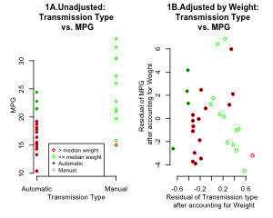
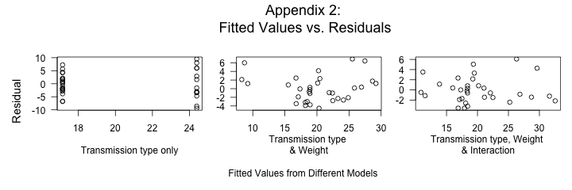

## Motor Trend Analysis
### Executive Summary
  In this issue of "Motor Trend," we examined whether type of transmission-- Automatic or Manual-- has any influence on miles per gallon (mpg). At first glance, manual transmission gave higher mpg than automatic. However, manual cars turned out to be lighter than automatic cars. Intuitively, the heavier the car is, the smaller the mpg gets. In fact, when weight difference was taken into consideration, there wasn't a meaningful difference between transmission types on mpg. So, the relationship between transmission types and mpg is not so simple. There are whole a lot of factors affecting mpg, and they tend to interact. When making purchase decisions, you relaly need to look at the whole package!

### Analysis and Discussions
```{r Figure1, echo=TRUE, message=FALSE, warning=FALSE, results='hide'}
setwd('~/Documents/Coursera/RegressionModels/MotorTrend'); library(datasets)
d = mtcars; d$am.f = as.factor(d$am) # (0 = automatic, 1 = manual)
mMPG.auto = round(mean(d$mpg[d$am.f=='0']),2); mMPG.man = round(mean(d$mpg[d$am.f=='1']),2);
sdMPG.auto = round(sd(d$mpg[d$am.f=='0']),2); sdMPG.man = round(sd(d$mpg[d$am.f=='1']),2);
dotCol = ifelse(d$wt>median(d$wt),'red','green'); dotBG = ifelse(d$am==0,'black','white')
png(file='Figure1.png', width=300, height=240, units="px", pointsize=7.5); par(mfrow = c(1, 2))
plot(mpg~am, data=d, pch=21, col=dotCol, bg=dotBG, mgp = c(2, 1, 0),
     main="1A.Unadjusted: \n Transmission Type \n vs. MPG",
     xlab="Transmission Type", ylab="MPG", cex=.8, axes=FALSE)
axis(1, 0:1, c('Automatic','Manual'), cex=.7); axis(2)
legend('bottom',c('> median weight','<= median weight','Automatic','Manual'), 
       pch=21, cex=.8, col=c('red','green','grey','grey'), pt.bg=c(NA,NA,'black',NA))
plot(resid(lm(am~wt, data=d)), resid(lm(mpg~wt, data=d)), 
     pch=21, col=dotCol, bg=dotBG, axes=FALSE, ann=FALSE, xaxt='n')
title(main="1B.Adjusted by Weight:\n Transmission Type \n vs. MPG"); 
title(ylab="Residual of MPG \n after accounting for Weight", mgp = c(2, 1, 0), cex=.7); 
title(xlab="Residual of Transmission type \n after accounting for Weight", mgp=c(3,1,0), cex=.7)
axis(1); axis(2); dev.off(); par(mfrow = c(1, 1))
```
```{r, echo=TRUE, message=FALSE, warning=FALSE}
lm.simple = lm(mpg~am.f, data=d); # model1: just am
lm.all = lm(mpg~., data=mtcars); # model2: all variables
lm.mix = lm(mpg~am.f+wt, data=d); # model3: am and wt
lmBoth <- lm(mpg~wt+am.f+wt*am.f,data=d) # model4: with interaction term
```
```{r Appendix, results='hide'}
png(file='Appendix1.png', width=240, height=240, units="px", pointsize=10);
plot(d$wt,d$mpg,pch=19,ann=FALSE); points(d$wt,d$mpg,pch=19,col=((d$am.f=="1")*1+1))
abline(c(lmBoth$coeff[1],lmBoth$coeff[2]),col=1,lwd=3) # automatic
abline(c(lmBoth$coeff[1]+lmBoth$coeff[3], lmBoth$coeff[2]+lmBoth$coeff[4]),col=2,lwd=3) # manual
title(main="Appendix 1:\n Interaction between \n Weight and Transmission Type");
title(ylab="MPG"); title(xlab="Weight(lb/1000)"); 
legend('topright',c('Automatic','Manual'), pch=21, col=c(1,2), pt.bg=c(1,2), lwd=3); dev.off()
png(file='Appendix2.png', width=720, height=240, units="px", pointsize=12)
par(mfrow=c(1,3), oma=c(3,3,4,0), mar=c(4,2,1,1), las=1, cex=1)
plot(lm.simple$fitted.values, lm.simple$res, xlab="Transmission type only", ylab="")
plot(lm.mix$fitted.values, lm.mix$res,xlab="Transmission type \n& Weight", ylab="")
plot(lmBoth$fitted.values, lmBoth$res, xlab="Transmission type, Weight \n& Interaction", ylab="")
mtext("Fitted Values from Different Models", 1, 1, outer=TRUE, cex=1); mtext("Residual", 2, 1, outer=TRUE, las=0,cex=1.2)
mtext("Appendix 2:\n Fitted Values vs. Residuals", 3, 1, outer=TRUE, cex=1.5); dev.off();par(mfrow = c(1, 1))
```
  
At exploratory level (Figure 1A), having a manual transmission appears to be better; on average, cars with manual transmissions (right column of Fig 1A, open circles) have higher mean mpg (m=`r mMPG.man`, SD=`r sdMPG.man`) than those with automatic (left column of Fig 1A, filled circles; m=`r mMPG.auto`, SD=`r sdMPG.auto`). A linear regression with just Transmission type confirms this observation, with Manual transmision adding `r round(summary(lm.simple)$coefficients[2,1],2)`mpg more to Automatic transmission (coef for Manual=`r round(summary(lm.simple)$coefficients[2,1]+summary(lm.simple)$coefficients[1,1],2)`, Automatic=`r round(summary(lm.simple)$coefficients[1,1],2)`mpg). However, Automatic vs. Manual may not be the only feature that influences mpg, nor may not be the strongest feature. In fact, this simple model did not account for large variance (r2=`r round(summary(lm.simple)$r.squared,2)`), and variance was not distributed near 0 (Appendix 2, left panel). The full-model (including all variables, r2=`r round(summary(lm.all)$r.squared,2)`) showed that the main effect of the weight approaching significance (coeff = `r round(summary(lm.all)$coefficient[6,1],3)`, p=`r round(summary(lm.all)$coefficient[6,4],3)`). No other variable shows main effect on mpg. Therefore, next I fit the model that included Transmission and Weight.    
  Consistent with the full-model, the main effect of Weight was significant (p<.001). On the other hand, controling for the Weight, the main effect of Transmission type on mpg is not significant, and interestingly, slightly negative (coef=`r round(summary(lm.mix)$coefficients[2,1],3)`, p=`r round(summary(lm.mix)$coefficients[2,4],3)`). Having a manual transmission decreases mpg by `r round(summary(lm.mix)$coefficients[2,1],3)`mpg from having an automatic transmission (`r round(summary(lm.mix)$coefficients[1,1],3)`mpg). This is because cars with automatic transmissions tend to be heavier (15 out of 19 filled circles are red, meaning that their weights were heavier than median of cars we sampled) than those with manual transmissions (only 1 out of 13 open circles is red). Figure 1B visually illustrates these findings that, after accounting for the vehicle Weight, Transmission type does not affect mpg; now more of the filled circles (Automatic) show large mpg. This model, which included Weight as well as Transmission type, accounted for more variance in data (r2=`r round(summary(lm.mix)$r.squared,2)`) than the simple model with just Transmission type. Further, residuals are distributed closer to 0 (Appendix 2, middle panel).  
  You might wonder, then, whether the best strategy is to pick a lighter car, regardless of the type of transmission. Not so fast. Another regression model with Transmission, Weight and interaction between them revealed a significant interaction (p<.005) between Transmission and Weight, meaning that there is a cossover between these factors. Appendix 1 shows that until the car gets to about 2700lb, Manual transmission gives you a better mpg compared to the cars of similar weight. However, once the car gets heavier than this point, Automatic would give you better mpg than Manual. This model explains more variance (r2=`r round(summary(lmBoth)$r.squared,2)`), residuals are distributed even closer to 0 (Appendix 2, right panel), and the improvement is significant (p=`r round(anova(lm.mix, lmBoth)$Pr[[2]],3)`). So, we showed that we could not draw a simple conclusion about types of Transmission on mpg, and rather, a buyer needs to consider other factors that are likely to interact with each other.        
  
### Appendix

  


  

