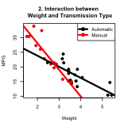

## Motor Trend Analysis
### Executive Summary
In this issue of "Motor Trend," we examined whether type of transmission-- Automatic or Manual-- has any influence on miles per gallon (mpg). At first glance, manual transmission gave higher mpg than automatic. However, manual cars turned out to be lighter than automatic cars. Intuitively, the heavier the car is, the smaller the mpg gets. In fact, when weight difference was taken into consideration, there wasn't a meaningful difference between transmission types on mpg. So, the relationship between transmission types and mpg is not so simple. There are whole a lot of factors affecting mpg, and they tend to interact. When making purchase decisions, you relaly need to look at the whole package!

### Analysis and Discussions
```{r Figure1, echo=TRUE, message=FALSE, warning=FALSE, results='hide'}
setwd('~/Documents/Coursera/RegressionModels/MotorTrend'); library(datasets)
# Perform an exploratory analysis and visualize 
d = mtcars; d$am.f = as.factor(d$am) # (0 = automatic, 1 = manual)
mMPG.auto = round(mean(d$mpg[d$am.f=='0']),2); mMPG.man = round(mean(d$mpg[d$am.f=='1']),2);
sdMPG.auto = round(sd(d$mpg[d$am.f=='0']),2); sdMPG.man = round(sd(d$mpg[d$am.f=='1']),2);
dotCol = ifelse(d$wt>median(d$wt),'red','green'); dotBG = ifelse(d$am==0,'black','white')
png(file='Figure1.png', width=240, height=240, units="px", pointsize=8); par(mfrow = c(1, 2))
plot(mpg~am, data=d, pch=21, col=dotCol, bg=dotBG, mgp = c(2, 1, 0),
     main="1A.Unadjusted \n Transmission Type \n vs. MPG",
     xlab="Transmission Type", ylab="MPG", cex=.75, axes=FALSE)
axis(1, 0:1, c('Automatic','Manual'), cex=.75); axis(2)
legend('bottom',c('> median weight','<= median weight','Automatic','Manual'), 
       pch=21, cex = .5,col=c('red','green','grey','grey'), pt.bg=c(NA,NA,'black',NA))
plot(resid(lm(am~wt, data=d)), resid(lm(mpg~wt, data=d)), 
     pch=21, col=dotCol, bg=dotBG, axes=FALSE, ann=FALSE, xaxt='n')
title(main="1B.Adjusted by Weight\n Transmission Type \n vs. MPG"); 
title(ylab="Residual of MPG \n after accounting for Weight", mgp = c(2, 1, 0), cex=.75); 
title(xlab="Residual of Transmission type \n after accounting for Weight", mgp=c(3,1,0), cex=.75)
axis(1); axis(2); dev.off(); par(mfrow = c(1, 1))
```
```{r, echo=TRUE, message=FALSE, warning=FALSE}
# model fits (tables not shown to be space-conscious)
lm.simple = lm(mpg~am.f, data=d); # just am
lm.all = lm(mpg~., data=mtcars); # all variables
lm.mix = lm(mpg~am.f+wt, data = d); # am and wt
lmBoth <- lm(d$mpg ~ d$wt+d$am.f+d$wt*d$am.f) # interaction term
```
```{r Figure2, results='hide'}
png(file='Figure2.png', width=160, height=160, units="px", pointsize=6); 
plot(d$wt,d$mpg,pch=19,ann=FALSE); points(d$wt,d$mpg,pch=19,col=((d$am.f=="1")*1+1))
abline(c(lmBoth$coeff[1],lmBoth$coeff[2]),col=1,lwd=3) # automatic
abline(c(lmBoth$coeff[1]+lmBoth$coeff[3], lmBoth$coeff[2]+lmBoth$coeff[4]),col=2,lwd=3) # manual
title(main="2. Interaction between \n Weight and Transmission Type"); title(ylab="MPG"); 
title(xlab="Weight"); 
legend('topright',c('Automatic','Manual'), pch=21, col=c(1,2), pt.bg=c(1,2), lwd=3); dev.off()
```
  At exploratory level (Figure 1A), having a manual transmission appears to be better; Cars with manual transmissions have higher mean mpg (m=`r mMPG.man`, SD=`r sdMPG.man`) than those with automatic (m=`r mMPG.auto`, SD=`r sdMPG.auto`). A linear regression with just Transmission type confirms this observation, with Manual transmision adding `r round(summary(lm.simple)$coefficients[2,1],2)`mpg more than Automatic transmission (`r round(summary(lm.simple)$coefficients[1,1],2)`mpg). However, Automatic vs. Manual may not be the only feature that influences mpg, nor may not be the strongest feature. The full-model (including all variables) showed that the main effect of the weight approaching significance (coeff = `r round(summary(lm.all)$coefficient[6,1],3)`, p=`r round(summary(lm.all)$coefficient[6,4],3)`). No other variable shows main effect on mpg. Therefore, next I fit the model that included Transmission, Weight and interaction between them.    

REWRITE ANALYSIS BASED ON BOTH MODELS WITH INTERATION
Consistent with the full-model, the main effect of weight is significant (p<.001). On the other hand, controling for the weight, the main effect of Transmission type on mpg is not significant, and interestingly, slightly negative (coef=`r round(summary(lm.mix)$coefficients[2,1],3)`, p=`r round(summary(lm.mix)$coefficients[2,4],3)`). Having a manual transmission decreases mpg by `r round(summary(lm.mix)$coefficients[2,1],3)`mpg from having an automatic transmission (`r round(summary(lm.mix)$coefficients[1,1],3)`mpg). This is because cars with automatic transmissions tend to have heavier (15 out of 19 cars; red dots in Figrue 1A) than those with manual transmissions (1 out of 13 cars).  Figure 1B visually illustrates these findings that, after accounting for the vehicle weight, Transmission type does not affest mpg.  
  
### Appendix
```{r appendix1, results='hide'}
png(file='appendix1.png', width=240, height=240, units="px", pointsize=8); plot(d$wt,d$mpg,pch=19,ann=FALSE); points(d$wt,d$mpg,pch=19,col=((d$am.f=="1")*1+1)) # (1 = automatic, 2 = manual)
abline(c(lmBoth$coeff[1],lmBoth$coeff[2]),col=1,lwd=3) # automatic
abline(c(lmBoth$coeff[1]+lmBoth$coeff[3], lmBoth$coeff[2]+lmBoth$coeff[4]),col=2,lwd=3) # manual
title(main="Interaction between \n Weight and Transmission Type"); title(ylab="MPG"); title(xlab="Weight"); legend('topright',c('Automatic','Manual'), pch=21, col=c(1,2), pt.bg=c(1,2), lwd=3); dev.off()
```
 

